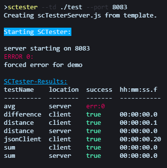
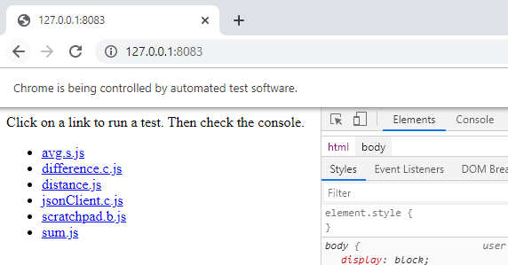

Note that this package is still in version 0.  In other
words, it may not work and troubleshooting it might be 
difficult at this time.  

Don't worry, over time this becomes increasingly usable.
When it seems robust enough, I'll mark it as version 1.

## Description

Just a simple testing tool to test javascript functions in both 
the client and server environments without having to write 
code for each (in the cases where the code is not specific to a server or client need).    

- Works on the console, one line.
- Final output is in table form.
- Errors are organized for reference.
- Output includes execution time.
- Server is created and started for you.
- Use the `--browser` boolean switch to launch a browser and run 
  client tests manually 

## File Setup

This program works by convention.  

Name your directory 'test', or pass your testing directory to --td.
Then, place the following files in this directory:

* **_imports.c.js:** List any client-side imports you wish to provide.
  These will appear as imports to any client file served.  It doesn't
  really have to be import statements.  It can be other code as well.  
* **_imports.s.js:** List any serer-side imports/requires you wish to
  provide.  These will be available to any server-side code.  It 
  doesn't have to be just imports/requires.  It can be other code as well.
* **.js:** Test file.  Be sure it has `test()` defined.  `test()`
  should have no parameters, and should return boolean, or throw 
  an error.  It can be defined as async.  The result of `test()` 
  will show up in the final output table listing all tests, or, if
  --browser was passed, it will show up in the menu.
* **.c.js:** Test file, only to be run as client code.
* **.s.js:** Test file, only to be run as server code. 
* **.b.js:** Test file, only to be available on the browser.  Test
  result will not show in the output table on the terminal.
* **.r.js:** Route-only file.  `server(request,response)` should be
  defined, and should end with calling `response.writeHead()` and 
  `response.end()` with appropriate parameters.
* **_:** Files beginning with an underscore are not treated as test
  files. 
* **other:** Any other files are available to be served from the serer.
  They are not treated as test files.  For instance, if you create 
  _data.json in the test directory, you can `fetch('./_data.json')` 
  from a client test.   

## Code setup

    npm install -g sctester

Then run sctester with options, as shown in the exmples below.

Puppeteer is required, so the install may take quite awhile.  If already installed and you're just updating, you may be able to get away with not installing it by creating an .npmrc file (no name, just the extension like .gitignore) and placing the following in it:

    puppeteer_skip_chromium_download=true

But this may only work on the developer end.  I haven't tested it as a user.

## Syntax and Parameters

    sctester --td ./somedirectory --otheroptions

- **--testDirectory:**  String.  Alias `--td`.  Defaults to './test'.  The 
  directory containing the test functions.
- **--port:** Integer.  Defaults to 8083.  The port on which to start
  puppeteer to run client tests.
- **--browser:** Boolean.  Defaults to false.  If set, opens a browser  
  and gives each test as a link.  Click on a link to execute the test.  You may want the console tab in the developer panel open.
- **--suppress:** Boolean. Defaults to false.  Suppresses error message
  output in the console.  This is helpful when error messages are very long and you're running many tests.

## Examples

Assuming a directory set up as above (see 'test' directory of this
project for an example), you would run code as follows: 

### Run all tests on the console: 

    scTester --td ./test --port 8083

Unfortunately, if you prefer your terminal as a panel to the right (like me), you'll have to expand it wide enough to ensure the table doesn't wrap.  

### Run individual tests from the browser:

    scTester --td ./test --port 8083 --browser

You shouldn't need to open a browser and navigate, the browser pops up for you at the home page with the developer panel visible, although you will have to click on the console tab yourself.

Click on any link to run the test.  The results will show in the console tab of the developer panel.

## History

This project started with some server-side and puppeteer code 
and eventually started turning into a framework of sorts.  I 
decided to make a library out of it.  

## Troubleshooting

If powershell is blocking you, remember to:

    Set-ExecutionPolicy -Scope CurrentUser -ExecutionPolicy Unrestricted
